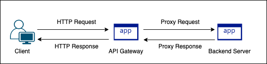
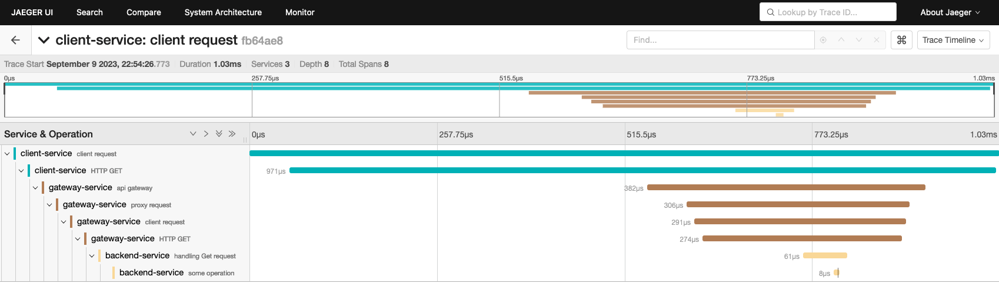
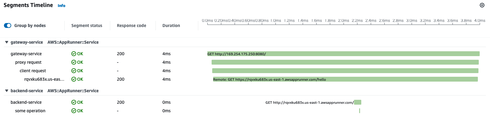

# OpenTelemetry Go SDK deep dive
Enjoy distributed tracing step by step.

## Usage

```
$ docker compose up --build
$ cd client
$ go run main.go
```

### Unit test
`backend` directory has test codes to check whether context is propagated via HTTP header.

```
$ go test ./backend
```

## Architecture


## Backend screenshots



